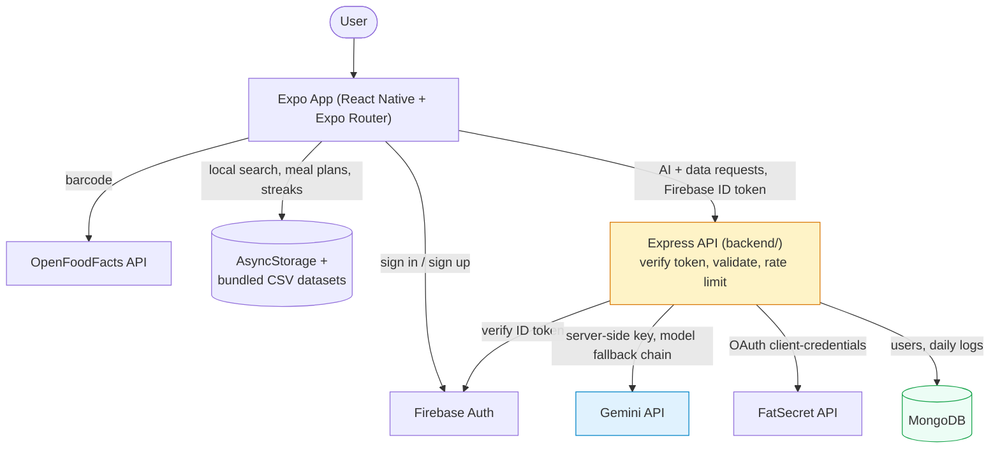

# 🥗 Sattva

**A React Native food-logging app that reads Indian food off a photo, scores it against ICMR nutrition guidelines, and turns tracking into something that doesn't feel like a chore.**

---

Point your camera at a dish, and Sattva identifies it, estimates calories and macros, and logs it — with a food database and diet-scoring model built specifically around Indian meals, not a generic US-centric calorie counter re-skinned for a different market.

## Table of Contents

- [Why I Built This](#why-i-built-this)
- [Features](#features)
- [Technical Highlights](#technical-highlights)
- [System Architecture](#system-architecture)
- [Data Flow — Photo to Dashboard](#data-flow--photo-to-dashboard)
- [Project Structure](#project-structure)
- [Tech Stack](#tech-stack)
- [Engineering Decisions](#engineering-decisions)
- [Challenges Solved](#challenges-solved)
- [Honest Limitations & Mocked Features](#honest-limitations--mocked-features)
- [Security Considerations](#security-considerations)
- [Performance Optimizations](#performance-optimizations)
- [Future Improvements](#future-improvements)
- [Quick Start](#quick-start)
- [Local Development](#local-development)
- [Testing](#testing)
- [Contributing](#contributing)
- [License](#license)

---

## Quick Start

Two processes: the backend (Express + MongoDB) and the Expo app. The app will not load or save anything
without the backend, because it has no database of its own.

**You need:** Node 22, and either a local MongoDB or a MongoDB Atlas connection string (or neither — see
step 3). Plus a Firebase project with Authentication enabled, and a Gemini API key for the AI features.

```bash
# 1. Install (two package trees)
npm install
cd backend && npm install && cd ..

# 2. Configure
cp .env.example .env                    # app: public values only (Firebase web config)
cp backend/.env.example backend/.env    # server: GEMINI_API_KEY, FIREBASE_PROJECT_ID, LOG_SALT, MONGODB_URI
```

In `backend/.env`, set `MONGODB_URI` to `mongodb://127.0.0.1:27017` for a local server, or to your
`mongodb+srv://...` string for Atlas (URL-encode the password). In `.env`, leave
`EXPO_PUBLIC_PROXY_BASE_URL` commented out: the app then finds the backend on your Wi-Fi network by itself,
and a browser uses `http://localhost:3000`. If it is set, that address wins and your local backend is ignored.

```bash
# 3. Start the backend  (terminal 1)
cd backend
npm run smoke:data     # optional: proves MONGODB_URI works, using a scratch database it drops afterwards
npm run dev            # http://localhost:3000, and prints the LAN URL your phone can reach
# No MongoDB to hand? npm run dev:memory  — same server on a throwaway in-memory database.

# 4. Start the app  (terminal 2, repo root)
npx expo start -c
```

Then scan the QR code with **Expo Go** (phone and computer on the same Wi-Fi), press **a** for an Android
emulator, or press **w** for the browser. Sign up with an email and password, complete onboarding, and log
a meal. Sign-in is required: every AI and data feature needs a Firebase ID token.

**If the app shows "Cannot reach Sattava":** the backend is not running, `EXPO_PUBLIC_PROXY_BASE_URL` points
somewhere else, or (on a phone) the two devices are on different networks.

```bash
# The checks CI runs, if you want them
npm run typecheck && npm run lint && npm test          # app
cd backend && npm run typecheck && npm test && npm run build
```

[Local Development](#local-development) has the full version: every environment variable, deployment to
Render, and production builds with EAS.

---

## Why I Built This

Most calorie trackers are built around a Western food database — a bowl of dal makhani, a paratha, or a plate of poha either isn't in the list or shows up with wildly wrong macros because it's been mapped to the nearest Western analogue. Portion sizes are also described in units (cups, ounces) that don't map naturally onto how Indian meals are actually served (a "1 piece" roti, a "1 bowl" dal, a "1 plate" thali).

Sattva starts from the other direction: the food database, the portion categories, the diet-scoring model, and the meal plans are all built around Indian eating patterns first. A photo of a dish goes through Gemini Vision with a prompt written specifically to prefer Indian dish names over generic ones, and portions like roti/paratha/naan are hard-coded to resolve to "1 piece" rather than small/medium/large, because that's how people actually think about them.

## Features

### 📷 AI Food Scan
Photograph a dish and the backend sends it to Gemini Vision through an ordered model fallback chain. The response is validated into a structured payload: item name, up to 5 detected items per photo, a portion category, a confidence score, and estimated calories/carbs/protein/fat. Nothing is trusted blindly: output is schema-validated and bounds-checked, unusable output falls through to the next model, and a hand-written rule forces roti/chapati/paratha/naan/kulcha to always report as `"1 piece"`. If analysis fails, the scan shows an explicit error and nothing is logged.

### 🔍 Barcode Scan
Packaged foods are looked up against the OpenFoodFacts API directly from the client (no backend involved) for barcode-based nutrition lookup.

### 🇮🇳 Local Indian Food Database
A CSV-derived dataset (`data/csvFoods.ts`, ~16k lines) plus a second hand-curated dataset (`data/indianFoodsDatabase.ts`, ~11k lines) provide an offline-searchable Indian food catalog. Search runs entirely on-device — no network round trip — with prefix and substring matching, and merges results from both sources while de-duplicating by name.

### 🥘 Ghar Ka Khana (Home-Cooked Dishes)
Users can save their own home-cooked dish recipes (name, ingredients, optional calorie estimate) to `AsyncStorage`, so a recurring home dish only needs to be logged once and can be reused going forward.

### 📅 Meal Planning
Deterministic meal-plan templates keyed by goal (weight loss / maintain / muscle gain) and diet type (Veg / Non-Veg / Vegan), each mapped to a time-of-day schedule (morning detox → breakfast → mid-morning → lunch → evening → dinner → bedtime) with a generated weekly grocery list. This is template lookup, not a generative or optimization model.

### 🍽️ Meal Combo Generator
Given a target calorie count, the combo generator keyword-matches local foods into "main" (roti/rice/biryani…), "side" (dal/paneer/curry…), and "extra" (curd/raita/salad…) buckets, picks one from each, and scales the macros proportionally so the combo lands on the target calorie count. It's a rules-and-scaling engine, not a recommendation model — see [Engineering Decisions](#engineering-decisions).

### 📈 Analytics & Indian Diet Score
A 0–100 diet score is computed from a fixed formula weighted across protein adequacy, fiber, calorie balance, hydration, and macro ratio — each benchmarked against ICMR (Indian Council of Medical Research) daily recommended values rather than generic Western RDAs. 7-day history charts are rendered with `react-native-gifted-charts`.

### 💬 AI Coach
A chat-style coach that responds to messages about water, protein, hunger, fatigue, progress, and "cheat day" guilt. **This is intent-matched template text, not an LLM call** — see the honesty note below. Separately, Gemini *is* used (via the backend, with local-copy fallback) for the daily insight and tip, the diet-score explanation, the weekly report, the voice-coach reply, and the onboarding plan.

### 🔥 Streaks, Missions & Achievements
Daily logging streaks, hydration and step-count missions, and an achievements screen for gamified consistency.

### 🚶 Step Counter
Accelerometer-based step counting via `expo-sensors`, using a peak-detection algorithm on 3-axis acceleration magnitude (not the device's native pedometer/step-counter sensor).

### 🎉 Festival Awareness
A local Indian festival calendar (`constants/IndianFestivals.ts`) surfaces fasting-appropriate food suggestions around festivals like Navratri and Ekadashi.

### ⚙️ Personalization & Onboarding
A generated user profile (goal, diet type, region, calorie/macro targets) drives meal plans, the diet score baseline, and coach responses throughout the app.

## Technical Highlights

- **Thin client, one authenticated backend for AI and data.** Only Firebase Auth and OpenFoodFacts are called directly from the Expo client. Every Gemini call and every read or write of user data runs on the Express/TypeScript backend (`backend/`), which verifies the caller's Firebase ID token first. The mobile bundle contains no AI provider SDK or key and no database driver or connection string; Jest guards (`__tests__/noClientGemini.test.ts`, `__tests__/noClientDatabase.test.ts`) and a CI script fail the build if either reappears.
- **Model fallback chain, validated inside each attempt.** Requests try an ordered list of Gemini models (`GEMINI_MODEL_CHAIN`) and fall through on failure. Failures are classified from the HTTP status and structured error fields rather than message substrings, and only an invalid API key aborts the whole chain. Output validation runs *inside* each attempt, so malformed or out-of-range output from one model falls through to the next instead of ending the request. `npm run check:models` probes every chain model against the live provider, because models get retired (the original `gemini-2.0` / `gemini-1.5` chain had been).
- **Two-layer output validation.** Model text goes through JSON extraction, then a Zod structural schema, then domain normalization (rounding, roti-as-`1 piece`, sanitising text that may have come from the photo), then hard bounds. Out-of-range nutrition is *rejected*, never clamped or defaulted. The mobile client re-checks every response with its own runtime guards.
- **A failed scan can never become a nutrition record.** There is no placeholder result: `analyzeFoodImage` throws, the scan screen shows an explicit failure message, and `isLoggableScanResolution` blocks any unnamed or out-of-range AI result before it reaches the daily log.
- **Content-addressed caching in two places.** The client caches scan results by the SHA-256 of the *full* image (7-day TTL); the server keeps a small in-memory LRU keyed on image hash, MIME type and prompt version (24 h). Only validated successes are ever cached.
- **Rate limiting and cost guards with no external infrastructure.** An in-memory sliding-window limiter applies per verified user (per minute and per day) and per IP, plus a global daily cap on Gemini attempts. Correct for a single instance; see Honest Limitations.
- **Structured AI observability.** Each AI request emits one JSON log line (request ID, hashed user ID, models tried and their outcomes, latency, cache hit/miss, validation warnings) and never images, prompts or keys. `npm run summarize:logs` turns those lines into failure rate, fallback distribution, latency percentiles, validation-rejection rate and cache hit rate.
- **Offline-first food search.** The primary food search path never leaves the device: it queries the bundled CSV/curated datasets, so search works with no connectivity and no external quota.
- **A data API that validates values, not just ownership, tested against a real MongoDB.** Users and daily logs live in MongoDB and are reached only through the backend. The owner of every document is the verified token's uid and is in every query; request bodies are strict schemas (no unknown fields, so no operators or paths of the client's choosing); per-entry and per-day caps are enforced by one atomic conditional update, so simultaneous requests cannot overshoot them; and deleting an entry takes exactly what it added back out of the totals. The tests run against a real in-memory `mongod` rather than mocks, including racing writes and operator-injection attempts.
- **CI on every pull request** (GitHub Actions, no secrets): typecheck, lint and tests for both packages, the backend production build, and a guard that fails if a Gemini key, SDK or endpoint, or a MongoDB driver or connection string, appears outside `backend/`.

## System Architecture



The backend exists because three things cannot safely run inside a distributed app binary: the Gemini API key, FatSecret's OAuth client secret and the database connection string (anyone can decompile an APK and read bundled strings). It also gives AI and data traffic one place to enforce authentication, validation, rate limits and observability.

| Route | Auth | Purpose |
|---|---|---|
| `POST /api/v1/vision/analyze-food` | Firebase ID token | Food photo to validated nutrition analysis |
| `POST /api/v1/coach/generate` | Firebase ID token | Server-owned text/JSON tasks: insight, tip, diet-score explanation, weekly report, voice coach, onboarding plan |
| `GET` / `PATCH /api/v1/me`, `POST /api/v1/me/sync` | Firebase ID token | The signed-in user's profile: sign-in sync, onboarding, targets, goal |
| `GET /api/v1/logs`, `GET /api/v1/logs/:date`, `POST /api/v1/logs/:date/entries`, `DELETE /api/v1/logs/:date/entries/:entryId` | Firebase ID token | Daily logs: read a day or a range, add an entry, delete an entry (the totals move atomically) |
| `GET /api/foods/search` | Firebase ID token | FatSecret proxy (legacy response contract; currently unused by the search screen, which reads the bundled dataset). Authenticated because it spends the server's FatSecret quota |
| `GET /health`, `GET /health/ready` | none | Liveness, and readiness (checks the database) |

All `/api/v1` errors use one envelope, `{ "error": { "code", "message", "requestId" } }`, with safe fixed messages; provider errors are logged internally and never returned. Clients send only validated numbers and enums for the coach tasks, never prompt text, so the endpoint is not a general-purpose LLM proxy.

## Data Flow — Photo to Dashboard

```mermaid
flowchart LR
    Photo["Food photo<br/>(base64)"] --> Hash["SHA-256 of full image<br/>(client cache key)"]
    Hash --> Cache{"Cached<br/>result?"}
    Cache -- yes --> Resolution
    Cache -- no --> Api["POST /api/v1/vision/analyze-food<br/>Bearer Firebase ID token"]
    Api --> Server["Server: validate image, LRU cache,<br/>Gemini model chain, Zod +<br/>normalization + bounds"]
    Server -->|"200 validated analysis"| Guard["Client response guards"]
    Server -->|"error envelope"| Failed["Explicit failed state<br/>(nothing is logged)"]
    Guard --> Resolution["ScanResolution<br/>(1-5 detected items,<br/>portion options, macros)"]
    Resolution --> Loggable{"isLoggable-<br/>ScanResolution?"}
    Loggable -- no --> Failed
    Loggable -- yes --> SetCache["Write to scan cache"]
    SetCache --> Log["logService to<br/>POST /api/v1/logs/:date/entries<br/>(MongoDB dailyLogs)"]
    Log --> Dashboard["Home dashboard<br/>(calorie ring, macro bars)"]
    Dashboard --> Analytics["7-day charts +<br/>Indian Diet Score"]
```



## Project Structure

```
Sattava-main/
├── app/                          # Expo Router file-based routes
│   ├── (auth)/                   # sign-in, sign-up (Firebase Auth)
│   ├── (tabs)/                   # home, analytics, diet, chat, profile
│   ├── log/                      # scan-food, manual-calories, manual-exercise,
│   │                             #   water-intake, yoga, ghar-ka-khana, saved-dishes
│   ├── onboarding.tsx            # goal / diet-type / region intake
│   ├── generating-profile.tsx    # profile generation screen
│   ├── combo-builder.tsx         # meal combo generator UI
│   ├── weekly-report.tsx         # AI-generated weekly insight screen
│   └── subscription.tsx          # "Sattva Pro" paywall UI (see Honest Limitations)
├── components/                   # ~30 reusable UI components (cards, modals, widgets)
├── services/                     # All API calls and business logic — no logic in screens
│   ├── aiService.ts              # AI facade: calls the backend; vision throws on failure, text falls back locally
│   ├── apiClient.ts              # Authenticated request layer (Firebase ID token, one refresh-retry, error mapping)
│   ├── aiApiClient.ts            # The AI calls over it + aiContract.ts response guards
│   ├── dataApi.ts                # Users and daily logs over it + dataContract.ts guards, dataEvents.ts
│   ├── liveData.ts               # "Live" subscriptions: one shared poll per topic + a refresh after every write
│   ├── scanService.ts            # Orchestrates barcode/Gemini scan → ScanResolution
│   ├── scanCache.ts              # Scan-result cache (SHA-256 of the full image, schema v4)
│   ├── photoCapture.ts           # Retakes oversized photos at a lower JPEG quality before upload
│   ├── fatSecretService.ts       # Client for the backend FatSecret proxy
│   ├── openFoodFactsService.ts   # Direct OpenFoodFacts barcode/text lookup
│   ├── csvFoodService.ts / localFoodService.ts / foodSearchService.ts
│   │                             # Local, offline Indian food search
│   ├── indianFoodService.ts      # ICMR-based Indian Diet Score calculation
│   ├── mealSchedulerService.ts   # Meal plan storage + time-of-day scheduling
│   ├── mealComboService.ts       # Rule-based meal combo generator
│   ├── dishService.ts            # "Ghar Ka Khana" saved home dishes (AsyncStorage)
│   ├── aiCoach.ts                # Deterministic intent-matched chat responses
│   ├── stepService.ts            # Accelerometer peak-detection step counter
│   ├── notificationService.ts    # expo-notifications scheduling
│   ├── logService.ts             # Log entries, deletes and the streak, over the data API
│   └── userService.ts            # Profile, targets and log-screen entries, over the data API
├── data/                         # Bundled datasets: csvFoods.ts, indianFoodsDatabase.ts,
│                                  #   indianFoods.ts (curated), mealPlans.ts (templates)
├── constants/                    # Colors, theme, Indian regions/festivals, healthy alternatives
├── context/                      # ThemeContext (light/dark)
├── backend/                      # TypeScript/Express API (see backend/README.md)
│   ├── src/                      # app factory, auth, rate limiting, AI (model chain, schemas, cache), data API (repository, schemas), MongoDB, routes
│   ├── tests/                    # Jest + supertest; a real in-memory MongoDB; Gemini and Firebase are faked
│   └── scripts/                  # check-gemini-models, smoke-vision, smoke-coach, smoke-data, dev-memory, summarize-ai-logs
├── scripts/
│   ├── processCsv.js             # One-time script: raw CSV → data/indianFoodsDatabase.ts
│   └── check-client-boundary.sh  # CI guard: no Gemini or MongoDB access outside backend/
├── __tests__/                    # Jest suites: API client, data client and live subscriptions, log/user services, scan and AI services,
│                                  #   photoCapture, food and input validation, meal scheduler, and the no-client-Gemini/database guards (externals mocked)
├── firebase.json                 # Firebase Auth configuration (sign-in providers, authorized domains)
├── .github/workflows/ci.yml      # CI: mobile, backend (against a real MongoDB), trust-boundary check
├── .env.example                  # Required environment variables template
└── app.json / eas.json           # Expo config + EAS Build profiles
```

## Tech Stack

| Layer | Technology | Notes |
|---|---|---|
| App framework | [Expo](https://expo.dev) ~54, [Expo Router](https://expo.github.io/router) ~6 | File-based routing, typed routes, React Compiler enabled |
| Language | TypeScript (strict mode) | |
| UI | React Native 0.81, React 19.1 | `react-native-reanimated` 4, `expo-blur`, `expo-linear-gradient` |
| Auth | Firebase Authentication | Email/password, Google, phone; the backend verifies ID tokens with the Firebase Admin SDK |
| Database | MongoDB (Atlas or self-hosted), official Node driver | One document per user and one per user per day; reached only through the backend API |
| AI / Vision | Google Gemini API (REST, backend only) | Ordered model chain from `GEMINI_MODEL_CHAIN`, checked by `npm run check:models` |
| Food search (online) | FatSecret API (via Express proxy), OpenFoodFacts API (direct) | |
| Food search (offline) | Bundled CSV + curated TypeScript datasets | No network required |
| Local storage | `@react-native-async-storage/async-storage` | Meal plans, saved dishes, steps, preferences |
| Charts | `react-native-gifted-charts` | |
| Notifications | `expo-notifications` | Meal & hydration reminders |
| Motion sensing | `expo-sensors` (Accelerometer) | Custom peak-detection step algorithm |
| Backend | Node.js 20+, Express, TypeScript, Zod, pino, Firebase Admin, MongoDB driver | Authenticated AI gateway and data API, plus the FatSecret proxy |
| Testing | Jest + `jest-expo` (app), Jest + `ts-jest` + supertest + a real in-memory MongoDB (backend) | Gemini and Firebase are faked, the database is real; CI on GitHub Actions |
| Icons | `@expo/vector-icons` | |

## Engineering Decisions

**Why Expo + Expo Router instead of bare React Native?**
Camera, sensors, notifications, secure storage, and OTA updates are all first-party Expo modules here — writing and maintaining native modules for each would be significant overhead for a project at this stage, and Expo Router's file-based routing keeps the `(auth)` / `(tabs)` / `log` split in the project structure directly mirroring the URL structure.

**Why does every data and AI call go through a backend?**
Because three things must never ship inside an app binary (anyone can decompile an APK and pull out bundled strings): the Gemini API key, FatSecret's OAuth client secret and a MongoDB connection string. Firebase Auth supports scoped, client-safe config by design, so sign-in stays client-direct. A backend also gives traffic one place to verify identity (Firebase ID token), validate input and output, rate-limit, cache, and log operational metadata. It is deliberately one small service rather than several: an earlier Python/FastAPI AI service was archived (`archive/ai-service` branch) instead of running two backends for one job.

**Why MongoDB, and why only behind the backend?**
The app's data is a profile document and one document per user per day (totals plus a list of entries), read whole and changed by small atomic updates. That fits a document database: adding an entry is one `$inc` and one `$push` on a single document, so the totals and the entries cannot disagree, and a delete takes the same amounts back out. A mobile client can never hold a database credential, so MongoDB is reached only through the authenticated API, where ownership comes from the verified token and every value is validated. The costs are real: there is no offline write queue, and "live" updates are a slow poll plus an immediate refresh after each write, not a push connection.

**Why Gemini over a fixed-format nutrition API for food recognition?**
There's no comprehensive nutrition API for photographed *Indian* home-cooked food specifically — packaged-goods databases like OpenFoodFacts cover barcodes well, but a home-cooked thali has no barcode. A vision-capable LLM prompted specifically for Indian dish names was the practical way to get a first-pass estimate, with the understanding (documented above and in Limitations) that it's an estimate, not lab-measured nutrition data.

**Why AsyncStorage for meal plans/steps/saved dishes instead of the database for everything?**
These are per-device, low-stakes, and don't need to sync across devices or survive a reinstall — putting them in the database would mean extra requests and API surface for data that doesn't benefit from being there.

**Why is the AI Coach a rule engine instead of an LLM call?**
It's a deliberate choice, made explicit here rather than left implicit: intent-matched template responses respond instantly, cost nothing per message, and never fail from a quota or network error — which matters for a chat surface a user might open dozens of times a day. The trade-off is that it can't handle anything outside its matched intents (water, protein, hunger, fatigue, progress, "cheat day" guilt) as gracefully as a real model would. Gemini is reserved for places where a generated answer is worth its cost and latency: photo analysis, the daily insight and tip, the diet-score explanation, the weekly report, and the onboarding plan. Each goes through the authenticated backend, is validated, and has a local fallback.

## Challenges Solved

- **Getting structured JSON reliably out of an LLM.** Model text is extracted (fences and surrounding prose stripped), validated against a Zod schema, normalized (rounded, portion/roti rules applied, text sanitised), and bounds-checked. Known quirks such as `"250 kcal"` strings are tolerated, but missing nutrition is rejected rather than replaced with invented defaults. Because validation runs inside each attempt, one model's bad output falls through to the next model.
- **Roti/paratha/naan don't scale like an amorphous plate of food.** A dedicated rule intercepts these dish names and forces their portion category to `"1 piece"` regardless of what the model returns, because "medium roti" isn't how anyone thinks about bread.
- **FatSecret's IP allowlisting in a dev environment with a rotating IP.** The proxy logs the server's public IP on startup and, on FatSecret's "invalid IP" error, returns a `502 IP_RESTRICTED` and logs whitelisting hints rather than a bare error.
- **Avoiding duplicate results across two local food datasets.** The unified Indian food search merges the curated dataset and the CSV-derived dataset while de-duplicating by lowercased name, so the same dish surfaced from both sources doesn't appear twice.
- **Preventing a bad scan from being cached or logged.** Only validated successes are cached (client and server), and `analyzeFoodImage` has no placeholder result: a failed analysis throws. The old "Unknown food / 250 kcal" default, which could previously have been logged as real nutrition, no longer exists.
- **Bounded memory for the rate limiter without a database.** Each key holds at most `max` timestamps and stale keys are swept opportunistically inside `check()` (no timers), so a long-running process doesn't leak memory from one-off visitors.
- **Gemini 3.x "thinking" made a simple extraction take about 10 seconds.** Measured live: roughly 900 hidden reasoning tokens per vision request. `thinkingLevel: minimal` returned the same output in about 2.5 s and is accepted by every model in the chain (`GEMINI_THINKING_LEVEL` changes it).

## Honest Limitations & Mocked Features

In the spirit of not overselling this repo:

> **AI Coach chat responses are not LLM-generated.** They're deterministic keyword/intent matching against template string arrays (`services/aiCoach.ts`), with an artificial 800ms delay added purely to feel conversational. Real Gemini calls (all via the backend) are limited to photo analysis, the daily insight and tip, the diet-score explanation, the weekly report, the voice-coach reply, and the onboarding plan.

> **The voice coach uses a hard-coded sample transcript.** `components/VoiceCoachButton.tsx` sends a fixed sentence ("I ate 2 rotis and a bowl of dal"); there is no speech recognition yet.

> **Rate limits and the server cache live in the memory of a single instance.** They reset on restart and would not be shared across instances; scaling out would need shared state (for example Redis), which is deliberately not introduced yet.
> **Logging needs a connection, and screens refresh by polling.** The old Firestore write queue is gone: a log that cannot be sent shows an error instead of being retried later. Screens refresh every 30 seconds in the foreground and immediately after the app's own writes, so a change made on another device appears within about 30 seconds.

> **Data from before the move to MongoDB is not migrated.** Existing users start with an empty log and set up their profile again. A one-off export from Firestore would need a Firebase service account, which the project deliberately does not use.

> **Photo scans need the backend, and there is no accuracy evaluation yet.** Hosting cold-start behaviour and real-world latency have not been measured in production. Gemini response times were seen to vary a lot in local testing, from about 2 s to the 12 s per-attempt cap within one evening, so a scan can fall back to a later model or, in a bad spell, fail cleanly after at most 30 s. There is no labelled photo set to quantify recognition accuracy. The validation guards against implausible output, not against plausible-but-wrong estimates.

> **Nothing here has been validated on a physical device, in an EAS native build, or against production.** Verified so far: unit and integration tests (the data API against a real in-memory MongoDB, the AI gateway with fake providers), a data-API smoke run against a local MongoDB 8 service, a real Gemini call from the backend, and a JavaScript bundle export. Not yet verified: a photo scan and logging on a real phone, an EAS/native build, the Render deployment (cold start, `TRUST_PROXY_HOPS`, real SIGTERM handling), a MongoDB Atlas cluster, and a production Gemini call authenticated with a real Firebase ID token.

> **Photo size on high-resolution phones is unmeasured.** The app retakes an oversized photo at JPEG quality 0.5, then 0.3, before uploading, but no real-device photo sizes have been measured, so it is unknown whether the highest-resolution phones fit under the 5 MB limit. Measurement gate: in a development build, take photos on representative devices (especially 48 MP and above) and read the `[scan] capture attempt` log lines. If 0.3 is not enough, consider `pictureSize` (Android, changes the preview geometry so it needs on-device checking) or `expo-image-manipulator` (a native dependency, so a new build).

> **The "Sattva Pro" subscription screen (`app/subscription.tsx`) is UI only.** Tapping subscribe sets a local `isPro` flag in AsyncStorage and shows a success alert — there is no payment processor, App Store/Play Store IAP, or server-side entitlement check wired up. No feature in the codebase currently gates on that flag either.

> **The Meal Combo Generator and meal plan templates are rule-based, not ML.** Combos are built by keyword-categorizing the local food dataset into main/side/extra buckets, picking randomly within a category, and linearly scaling macros to hit a target calorie count — there's no optimization or learning involved. Meal plans are fixed templates keyed by goal and diet type, not generated per-user.

> **The step counter uses the phone's raw accelerometer, not a step-counter/pedometer sensor.** It's a manually tuned peak-detection algorithm (fixed threshold, debounce window) rather than the OS-level step API, so accuracy will vary more by device and carry position than a native pedometer would.

> **Nutrition estimates from photo scans are estimates, not lab measurements.** Gemini's calorie/macro output for a photographed dish is a best-effort visual estimate and should be read as directional, not precise — this applies to any photo-based food scanner, not just this one.

## Security Considerations

- **Environment variables split by trust boundary.** `EXPO_PUBLIC_*` variables are bundled into the client at build time and are effectively public (Firebase web config, the API URL). The Gemini key, the MongoDB connection string, FatSecret credentials and the log-hashing salt live only in the backend's environment (`backend/.env.example`).
- **Every route that costs money or touches user data needs a verified token.** Vision, coach, the whole data API and the FatSecret food proxy all run `requireAuth` first, and the owner of a document is always the token's uid: no request body, query or path carries an identity. A per-IP limit runs before token verification so an anonymous flood is cheap to refuse.
- **The Gemini key and the database credential are backend-only, and CI enforces it.** All Gemini and MongoDB traffic originates from the backend. `scripts/check-client-boundary.sh` (run in CI) and `__tests__/noClientGemini.test.ts` / `__tests__/noClientDatabase.test.ts` fail if a key variable, a Gemini SDK or endpoint, a MongoDB driver, connection string or variable, or a Firestore client appears anywhere outside `backend/`.
- **Every AI and data request needs a signed-in Firebase user.** The mobile app sends the user's Firebase ID token as a Bearer token, and the backend verifies it with the Firebase Admin SDK (project ID only; no service-account credential is stored). The backend's `FIREBASE_PROJECT_ID` must be the same Firebase project the app signs in against, or every token is rejected. Identity comes only from the verified token: request bodies are strict schemas, a client-supplied `userId`/`uid` is rejected, and rate limits and logs use the verified UID.
- **Request and image validation.** Bodies are parsed only after authentication and per-user limits; images are size-capped (5 MB decoded), must be valid base64, and their magic bytes must match the claimed type. The app retakes an oversized photo at a lower JPEG quality before uploading (see Honest Limitations for what is still unmeasured).
- **Untrusted model output.** Output is schema-validated and bounds-checked, and text that may originate from the photo is stripped of control/invisible characters and length-capped. Prompts are server-owned and user free text is limited to a short, delimited voice transcript.
- **Rate limiting.** Per verified user (per minute and per day), per IP (`trust proxy` is configured so `X-Forwarded-For` cannot be spoofed), plus a global daily cap on provider attempts. 429 responses carry `Retry-After`.
- **No secrets or provider errors leak.** Logs redact credentials and never contain images, prompts or tokens; clients only ever see fixed error messages.
- **The data API enforces ownership and value integrity** (`backend/src/data`, tested against a real MongoDB):
  - Every query carries the verified uid. No path, query string or body ever names a user, a supplied `uid`/`userId` is rejected, and another user's entry id is a 404.
  - Bodies are strict schemas: unknown fields, MongoDB operators (`$set` and the like), dotted paths and `__proto__` are rejected, and numbers must be numbers in range.
  - Per-entry and per-day caps (for example 10,000 kcal an entry, 30,000 kcal a day and 500 entries a day) are enforced by one atomic conditional update, so simultaneous requests cannot overshoot them. They are sanity bounds, not nutrition advice.
  - A database outage is a 503 with a fixed message. The connection string and its password are scrubbed from every log line, and startup fails fast, naming only the variable, when `MONGODB_URI` is missing or unreachable.

## Performance Optimizations

- **Offline-first local search** avoids a network round trip and external API quota entirely for the common case of searching the Indian food database.
- **Content-addressed caching** (SHA-256 of the full image on the client; image hash + MIME type + prompt version on the server; raw barcode as the key) skips redundant Gemini/OpenFoodFacts calls for repeat scans.
- **5-minute in-memory caching** of insight/tip text on the client, keyed by the exact stat values, so re-rendering the dashboard doesn't trigger a new request for unchanged stats.
- **Model chain ordered by measured latency and reliability,** with `thinkingLevel: minimal` for extraction (about 4x faster than default reasoning in a live measurement), so the common path is one fast call and fallbacks only run on failure.
- **Local-first storage** (AsyncStorage) for meal plans, saved dishes, and step counts keeps frequently-read, per-device data off the network path entirely.

## Future Improvements

Realistic next steps, not a wishlist:

- Wire the `isPro` flag to an actual payment provider (RevenueCat or native IAP) and gate the features the subscription screen currently advertises.
- Replace the accelerometer-based step counter with the platform pedometer API (`expo-sensors` Pedometer or `CMPedometer`/`Google Fit`) where available, for better accuracy.
- Expand AI Coach beyond keyword matching — either a small set of additional intents, or an opt-in LLM-backed mode for open-ended questions.
- Add integration/E2E tests beyond the current service-layer unit tests (scan flow, meal scheduler UI, auth flow).
- Add an offline write queue for logging, and a push channel (for example server-sent events) if polling turns out to be too slow.
- Migrate existing Firestore data, if there is any worth keeping.
- Build a small labelled Indian-food photo set to measure recognition accuracy, and track it per prompt version.
- Measure real cold-start and inference latency after deploying the backend, and optimise from that evidence.

## Local Development

### Prerequisites

- **Node.js 22** (CI uses 22; the backend needs 20.3 or newer, Expo SDK 54 needs 20.19 or newer) and npm.
- **MongoDB**: a connection string for a local MongoDB or an Atlas cluster. To try the app with none, `npm run dev:memory` in `backend/` runs against a throwaway in-memory database.
- A **Firebase project** with Authentication enabled (no Firebase database is used). Sign-in is required to use any AI or data feature, so the app and the backend must point at the same project.
- A **Gemini API key** (Google AI Studio), used only by the backend.

### 1. Clone & install

```bash
git clone <repo-url>
cd Sattava-main

npm install                       # mobile app
cd backend && npm install && cd ..  # backend
```

### 2. Configure environment variables

```bash
cp .env.example .env                   # mobile: public values only
cp backend/.env.example backend/.env   # backend: secrets
```

**Mobile `.env`** (everything here is bundled into the app, so it must not hold secrets):

| Variable | Purpose |
|---|---|
| `EXPO_PUBLIC_FIREBASE_*` | Firebase web config (API key, auth domain, project ID, ...). The web API key is public by design; the backend verifies every ID token, so the key alone grants no access to data |
| `EXPO_PUBLIC_GOOGLE_*_CLIENT_ID` | Google sign-in (optional) |
| `EXPO_PUBLIC_PROXY_BASE_URL` | URL of the deployed backend. In development it can be omitted: the app auto-detects the backend on your LAN |

**Backend `backend/.env`** (server-side only):

| Variable | Required | Purpose |
|---|---|---|
| `GEMINI_API_KEY` | yes | Gemini key. Never put it in the app or in EAS variables |
| `FIREBASE_PROJECT_ID` | yes | Firebase project used to verify ID tokens; must match the app |
| `LOG_SALT` | yes | 16+ random characters; user IDs are HMAC'd with it before logging |
| `MONGODB_URI` | yes | MongoDB connection string: local `mongodb://127.0.0.1:27017`, or Atlas `mongodb+srv://...`. A secret: never put it in the app or in EAS variables |
| `MONGODB_DB` | no | Database name inside the cluster (default `sattava`) |
| `GEMINI_MODEL_CHAIN` | no | Ordered model list. The default lives in `backend/src/config.ts` |
| `GEMINI_THINKING_LEVEL` | no | `minimal` (default), `low` or `off` |
| `TRUST_PROXY_HOPS` | no | Proxies in front of the server (default `1`, correct for Render) |
| `CORS_ORIGINS` | no | Browser origins allowed by CORS; native apps need none |
| `PORT`, rate limits, timeouts, `FATSECRET_*` | no | See `backend/.env.example` |

The backend refuses to start on invalid configuration and reports variable names only, never values.

### 3. Run the backend

```bash
cd backend
npm run check:models   # verify the model chain against the live provider
npm run smoke:data     # prove MONGODB_URI works: the whole data flow against a scratch database it drops afterwards
npm run dev            # start with reload; prints phone-reachable LAN URLs
npm run dev:memory     # no MongoDB yet? the same, on a throwaway in-memory database (data is lost on exit)
```

### 4. Run the Expo app

```bash
npx expo start
```

Scan the QR code with Expo Go, or press `a` / `i` for an Android/iOS emulator. Your phone and computer must be on the same Wi-Fi network for the LAN auto-detection to work. In a browser (`w`, or `npx expo start --web`) the app uses `http://localhost:3000`, and the backend allows the Expo web origins by default in development. Leave `EXPO_PUBLIC_PROXY_BASE_URL` unset for local development: if it points at a deployed backend, that backend is what the app calls.

### 5. Deploy the backend (Render)

| Setting | Value |
|---|---|
| Root directory | `backend` |
| Build command | `npm ci --include=dev && npm run build` |
| Start command | `npm start` |
| Health check path | `/health` |
| Environment | `GEMINI_API_KEY`, `FIREBASE_PROJECT_ID`, `LOG_SALT`, `MONGODB_URI`, `TRUST_PROXY_HOPS=1`, and `NODE_VERSION` (20.3 or newer) |

Details, a release checklist and the key-rotation order are in `backend/README.md`; the step-by-step version, with exact commands, the device checks, the MongoDB Atlas setup and rollbacks, is in `docs/RELEASE_RUNBOOK.md`. The old start command (`node server.js`) no longer exists.

### 6. Production app build (EAS)

```bash
npm install -g eas-cli
eas login
eas init
eas build --platform android --profile preview
eas build --platform all --profile production
```

Before a real production build: set your own `android.package` / `ios.bundleIdentifier` in `app.json`, add your own `projectId` from `eas init`, and set the `EXPO_PUBLIC_*` values (Firebase config and the API URL only) in your EAS environment. No native EAS build has been run against these changes yet; see Honest Limitations.

## Testing

| What | Command | Notes |
|---|---|---|
| Mobile typecheck | `npm run typecheck` | `tsc --noEmit` |
| Mobile lint | `npm run lint` | `expo lint`; 0 errors, some pre-existing warnings |
| Mobile tests | `npm test` | Jest + `jest-expo`; all external services faked |
| Backend typecheck | `cd backend && npm run typecheck` | |
| Backend tests | `cd backend && npm test` | Jest + supertest; a real in-memory MongoDB; Gemini and Firebase faked |
| Trust boundary check | `bash scripts/check-client-boundary.sh` | No Gemini or MongoDB access outside `backend/` |
| Data API smoke test | `cd backend && npm run smoke:data` | The whole data flow against YOUR MongoDB (`MONGODB_URI`), in a scratch database it drops afterwards |

None of the default test commands needs credentials. The backend tests start a real in-memory `mongod`; its binary (about 75 MB) is downloaded once by `npm install` in `backend/` and then cached.

**App tests** cover the API client (`aiApiClient`: auth header, token refresh, error mapping, response guards), the API base-URL resolution (configured URL, LAN, browser), the data client and its response guards, the live subscriptions (change detection, shared polling, refresh after a write, backgrounding), the log and user services (payloads, the streak, delete), the request bodies the services build (checked against the server's schemas through a shared fixture), `aiService`, `scanService` (cache key, failed-scan guard), `photoCapture`, `fatSecretService`, `mealSchedulerService`, input and food-data validation, and the no-client-Gemini, no-client-database and no-hidden-characters guards.

**Backend tests** cover authentication, request/image validation, the model fallback chain and its time bounds, the failure classifier, output validation and normalization, caching, rate limiting, the error envelope, config validation, graceful shutdown (including closing the database), log hygiene (no keys, images, prompts or connection strings), and the log summarizer.

**Data API tests** run against a real MongoDB (an in-memory `mongod`), not mocks. They cover: totals moving atomically (fifty simultaneous adds sum exactly), per-day caps holding under concurrency (exactly thirty of forty succeed), deleting an entry reversing exactly its effect (macros, calories burned, a whole litre of water), racing deletes reversing once, one user never reaching another's data, strict validation (negative and oversized values, unknown fields, operator and `__proto__` injection, bad dates), the per-user rate limit, database outages (a fixed 503, nothing leaked), and startup and shutdown.

### Continuous integration

`.github/workflows/ci.yml` runs on every pull request and every push to `main`, on Node 22, with no secrets. It deliberately does not run an EAS/native build.

| Job | Runs |
|---|---|
| `mobile` | `npm ci`, typecheck, lint, tests |
| `backend` | `npm ci`, typecheck, tests against a real MongoDB (its binary cached), and the production build Render runs |
| `security` | `scripts/check-client-boundary.sh`, plus a check that no `.env`, service-account or key files are tracked |

## Contributing

PRs welcome. CI must pass: it runs the same typecheck, lint and test commands listed under Testing. Run them locally first.

The project uses ESLint with `eslint-config-expo`. Please keep service-layer logic in `services/` rather than in screens. When the app starts sending a new field to the API, add it to the strict schema in `backend/src/data/schemas.ts` (and to `types/data.ts`) and cover it in the backend tests, or the request will be rejected.

## License

MIT — see [`LICENSE`](LICENSE).
