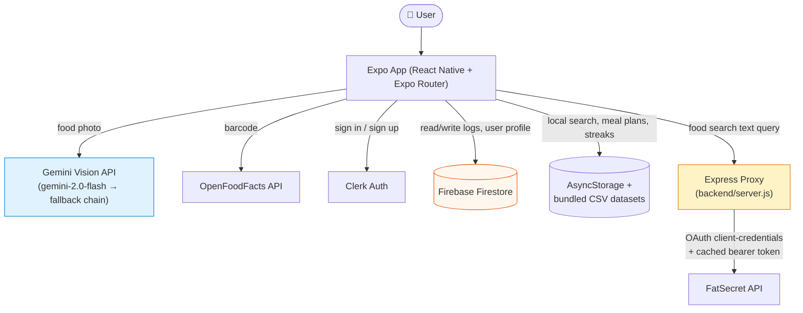
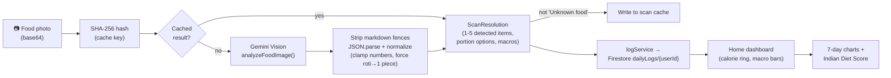

# 🥗 Sattva

**A React Native food-logging app that reads Indian food off a photo, scores it against ICMR nutrition guidelines, and turns tracking into something that doesn't feel like a chore.**

---

Point your camera at a dish, and Sattva identifies it, estimates calories and macros, and logs it — with a food database and diet-scoring model built specifically around Indian meals, not a generic US-centric calorie counter re-skinned for a different market.

## Table of Contents

- [Why I Built This](#why-i-built-this)
- [Features](#features)
- [Technical Highlights](#technical-highlights)
- [System Architecture](#system-architecture)
- [Data Flow — Photo to Dashboard](#data-flow--photo-to-dashboard)
- [Project Structure](#project-structure)
- [Tech Stack](#tech-stack)
- [Engineering Decisions](#engineering-decisions)
- [Challenges Solved](#challenges-solved)
- [Honest Limitations & Mocked Features](#honest-limitations--mocked-features)
- [Security Considerations](#security-considerations)
- [Performance Optimizations](#performance-optimizations)
- [Future Improvements](#future-improvements)
- [Local Development](#local-development)
- [Testing](#testing)
- [Contributing](#contributing)
- [License](#license)

---

## Why I Built This

Most calorie trackers are built around a Western food database — a bowl of dal makhani, a paratha, or a plate of poha either isn't in the list or shows up with wildly wrong macros because it's been mapped to the nearest Western analogue. Portion sizes are also described in units (cups, ounces) that don't map naturally onto how Indian meals are actually served (a "1 piece" roti, a "1 bowl" dal, a "1 plate" thali).

Sattva starts from the other direction: the food database, the portion categories, the diet-scoring model, and the meal plans are all built around Indian eating patterns first. A photo of a dish goes through Gemini Vision with a prompt written specifically to prefer Indian dish names over generic ones, and portions like roti/paratha/naan are hard-coded to resolve to "1 piece" rather than small/medium/large, because that's how people actually think about them.

## Features

### 📷 AI Food Scan
Photograph a dish and Gemini Vision (`gemini-2.0-flash`, with an ordered fallback chain down to `gemini-1.5-flash-8b`) returns a structured JSON payload: item name, up to 5 detected items per photo, a portion category, a confidence score, and estimated calories/carbs/protein/fat. Every parse is defensive — numbers are coerced and clamped, unknown portion strings fall back to `medium`, and a hand-written rule forces roti/chapati/paratha/naan/kulcha to always report as `"1 piece"` regardless of what the model returns.

### 🔍 Barcode Scan
Packaged foods are looked up against the OpenFoodFacts API directly from the client (no backend involved) for barcode-based nutrition lookup.

### 🇮🇳 Local Indian Food Database
A CSV-derived dataset (`data/csvFoods.ts`, ~16k lines) plus a second hand-curated dataset (`data/indianFoodsDatabase.ts`, ~11k lines) provide an offline-searchable Indian food catalog. Search runs entirely on-device — no network round trip — with prefix and substring matching, and merges results from both sources while de-duplicating by name.

### 🥘 Ghar Ka Khana (Home-Cooked Dishes)
Users can save their own home-cooked dish recipes (name, ingredients, optional calorie estimate) to `AsyncStorage`, so a recurring home dish only needs to be logged once and can be reused going forward.

### 📅 Meal Planning
Deterministic meal-plan templates keyed by goal (weight loss / maintain / muscle gain) and diet type (Veg / Non-Veg / Vegan), each mapped to a time-of-day schedule (morning detox → breakfast → mid-morning → lunch → evening → dinner → bedtime) with a generated weekly grocery list. This is template lookup, not a generative or optimization model.

### 🍽️ Meal Combo Generator
Given a target calorie count, the combo generator keyword-matches local foods into "main" (roti/rice/biryani…), "side" (dal/paneer/curry…), and "extra" (curd/raita/salad…) buckets, picks one from each, and scales the macros proportionally so the combo lands on the target calorie count. It's a rules-and-scaling engine, not a recommendation model — see [Engineering Decisions](#engineering-decisions).

### 📈 Analytics & Indian Diet Score
A 0–100 diet score is computed from a fixed formula weighted across protein adequacy, fiber, calorie balance, hydration, and macro ratio — each benchmarked against ICMR (Indian Council of Medical Research) daily recommended values rather than generic Western RDAs. 7-day history charts are rendered with `react-native-gifted-charts`.

### 💬 AI Coach
A chat-style coach that responds to messages about water, protein, hunger, fatigue, progress, and "cheat day" guilt. **This is intent-matched template text, not an LLM call** — see the honesty note below. Separately, Gemini *is* used (with local-template fallback) to generate a 3-line daily insight and a one-line daily health tip based on the user's actual logged stats.

### 🔥 Streaks, Missions & Achievements
Daily logging streaks, hydration and step-count missions, and an achievements screen for gamified consistency.

### 🚶 Step Counter
Accelerometer-based step counting via `expo-sensors`, using a peak-detection algorithm on 3-axis acceleration magnitude (not the device's native pedometer/step-counter sensor).

### 🎉 Festival Awareness
A local Indian festival calendar (`constants/IndianFestivals.ts`) surfaces fasting-appropriate food suggestions around festivals like Navratri and Ekadashi.

### ⚙️ Personalization & Onboarding
A generated user profile (goal, diet type, region, calorie/macro targets) drives meal plans, the diet score baseline, and coach responses throughout the app.

## Technical Highlights

- **Client-does-almost-everything architecture.** Gemini Vision, Firebase, OpenFoodFacts, and Clerk are all called directly from the Expo client. The only backend that exists is a narrow Express proxy for one thing: FatSecret's OAuth client-credentials flow.
- **Model fallback chain, not a single point of failure.** Every Gemini call tries `gemini-2.0-flash` → `gemini-2.0-flash-lite` → `gemini-1.5-flash` → `gemini-1.5-flash-8b` in order, skipping ahead on rate limits (`gemini-2.0-*` and `gemini-1.5-*` draw from separate quota pools) and stopping immediately on an API-key error rather than burning through the whole chain pointlessly.
- **Every Gemini-touching function is designed to never throw.** Parsing failures, empty responses, and exhausted quota all resolve to typed defaults or a pool of local template strings, so a flaky AI call degrades the UI rather than crashing it.
- **Content-addressed caching for scans.** Image scan results are cached by a SHA-256 hash of (a sample of) the image bytes, and barcode results by the barcode itself — so re-scanning the same photo or product doesn't re-spend an API call. Deliberately, a result whose label is `"Unknown food"` is *never* cached, so a transient Gemini failure doesn't get permanently baked in for that image.
- **A hand-rolled rate limiter with no external dependency.** The backend proxy implements its own sliding-window limiter (30 requests/minute/IP) using a `Map` of timestamps, purged periodically so memory doesn't grow unbounded — no `express-rate-limit` or Redis needed for a single-endpoint proxy.
- **Offline-first food search.** The primary food search path never leaves the device — it queries the bundled CSV/curated datasets — so search works with no connectivity and no external quota.

## System Architecture



The Express backend is intentionally minimal — it is **not** a general-purpose API. FatSecret issues OAuth 2.0 client-credentials that must not be embedded in a distributed app binary, so the proxy exists solely to fetch, cache, and forward that bearer token behind the single `/api/foods/search` route it exposes (plus a `/health` check). Everything else — Gemini, Firestore, OpenFoodFacts, Clerk — is called straight from the client with no server in between.

## Data Flow — Photo to Dashboard



## Project Structure

```
Sattava-main/
├── app/                          # Expo Router file-based routes
│   ├── (auth)/                   # sign-in, sign-up (Clerk)
│   ├── (tabs)/                   # home, analytics, diet, chat, profile
│   ├── log/                      # scan-food, manual-calories, manual-exercise,
│   │                             #   water-intake, yoga, ghar-ka-khana, saved-dishes
│   ├── onboarding.tsx            # goal / diet-type / region intake
│   ├── generating-profile.tsx    # profile generation screen
│   ├── combo-builder.tsx         # meal combo generator UI
│   ├── weekly-report.tsx         # AI-generated weekly insight screen
│   └── subscription.tsx          # "Sattva Pro" paywall UI (see Honest Limitations)
├── components/                   # ~30 reusable UI components (cards, modals, widgets)
├── services/                     # All API calls and business logic — no logic in screens
│   ├── geminiVisionService.ts    # Gemini calls, model fallback, JSON normalization
│   ├── scanService.ts            # Orchestrates barcode/Gemini scan → ScanResolution
│   ├── scanCache.ts              # SHA-256 keyed cache for scan results
│   ├── fatSecretService.ts       # Client for the backend FatSecret proxy
│   ├── openFoodFactsService.ts   # Direct OpenFoodFacts barcode/text lookup
│   ├── csvFoodService.ts / localFoodService.ts / foodSearchService.ts
│   │                             # Local, offline Indian food search
│   ├── indianFoodService.ts      # ICMR-based Indian Diet Score calculation
│   ├── mealSchedulerService.ts   # Meal plan storage + time-of-day scheduling
│   ├── mealComboService.ts       # Rule-based meal combo generator
│   ├── dishService.ts            # "Ghar Ka Khana" saved home dishes (AsyncStorage)
│   ├── aiCoach.ts                # Deterministic intent-matched chat responses
│   ├── stepService.ts            # Accelerometer peak-detection step counter
│   ├── notificationService.ts    # expo-notifications scheduling
│   ├── logService.ts             # Firestore read/write for daily food logs
│   └── userService.ts            # Firestore user profile read/write
├── data/                         # Bundled datasets: csvFoods.ts, indianFoodsDatabase.ts,
│                                  #   indianFoods.ts (curated), mealPlans.ts (templates)
├── constants/                    # Colors, theme, Indian regions/festivals, healthy alternatives
├── context/                      # ThemeContext (light/dark)
├── backend/
│   ├── server.js                 # Express proxy: FatSecret OAuth + rate limiting only
│   └── package.json
├── scripts/processCsv.js         # One-time script: raw CSV → data/indianFoodsDatabase.ts
├── __tests__/                    # Jest suites for fatSecretService, geminiVisionService,
│                                  #   mealSchedulerService (all external deps mocked)
├── firestore.rules               # Per-user ownership security rules
├── .env.example                  # Required environment variables template
└── app.json / eas.json           # Expo config + EAS Build profiles
```

## Tech Stack

| Layer | Technology | Notes |
|---|---|---|
| App framework | [Expo](https://expo.dev) ~54, [Expo Router](https://expo.github.io/router) ~6 | File-based routing, typed routes, React Compiler enabled |
| Language | TypeScript (strict mode) | |
| UI | React Native 0.81, React 19.1 | `react-native-reanimated` 4, `expo-blur`, `expo-linear-gradient` |
| Auth | [Clerk](https://clerk.com) (`@clerk/clerk-expo`) | Client-side auth session management |
| Database | Firebase Firestore v12 | Per-user document + subcollections |
| AI / Vision | Google Gemini API (`@google/generative-ai`) | `gemini-2.0-flash` primary, 3-model fallback chain |
| Food search (online) | FatSecret API (via Express proxy), OpenFoodFacts API (direct) | |
| Food search (offline) | Bundled CSV + curated TypeScript datasets | No network required |
| Local storage | `@react-native-async-storage/async-storage` | Meal plans, saved dishes, steps, preferences |
| Charts | `react-native-gifted-charts` | |
| Notifications | `expo-notifications` | Meal & hydration reminders |
| Motion sensing | `expo-sensors` (Accelerometer) | Custom peak-detection step algorithm |
| Backend | Node.js + Express | Single-purpose OAuth/rate-limit proxy |
| Testing | Jest + `jest-expo` | Service-layer unit tests, all externals mocked |
| Icons | `@expo/vector-icons`, `@hugeicons/react-native` | |

## Engineering Decisions

**Why Expo + Expo Router instead of bare React Native?**
Camera, sensors, notifications, secure storage, and OTA updates are all first-party Expo modules here — writing and maintaining native modules for each would be significant overhead for a project at this stage, and Expo Router's file-based routing keeps the `(auth)` / `(tabs)` / `log` split in the project structure directly mirroring the URL structure.

**Why a backend at all, if everything else is client-direct?**
Because FatSecret's OAuth client-credentials flow requires a secret that must never ship inside an app binary — anyone can decompile an APK and pull out bundled strings. Firebase, Gemini, and Clerk all support scoped, client-safe keys/tokens by design; FatSecret does not, so it's the one integration that needed a server in front of it.

**Why Firebase/Firestore over a custom backend + SQL database?**
Real-time sync (calorie ring updates live as logs are written), no server to provision for reads/writes, and security rules that map cleanly onto "a user can only touch their own subtree" — which is exactly the access pattern this app needs.

**Why Gemini over a fixed-format nutrition API for food recognition?**
There's no comprehensive nutrition API for photographed *Indian* home-cooked food specifically — packaged-goods databases like OpenFoodFacts cover barcodes well, but a home-cooked thali has no barcode. A vision-capable LLM prompted specifically for Indian dish names was the practical way to get a first-pass estimate, with the understanding (documented above and in Limitations) that it's an estimate, not lab-measured nutrition data.

**Why AsyncStorage for meal plans/steps/saved dishes instead of Firestore for everything?**
These are per-device, low-stakes, and don't need to sync across devices or survive a reinstall — putting them in Firestore would mean extra reads/writes and security-rule surface area for data that doesn't benefit from being there.

**Why is the AI Coach a rule engine instead of an LLM call?**
It's a deliberate choice, made explicit here rather than left implicit: intent-matched template responses respond instantly, cost nothing per message, and never fail from a quota or network error — which matters for a chat surface a user might open dozens of times a day. The trade-off is that it can't handle anything outside its matched intents (water, protein, hunger, fatigue, progress, "cheat day" guilt) as gracefully as a real model would. Gemini is reserved for the two places in the app where its cost and latency are worth it: the daily insight and the daily tip, both computed once per changed-stat set and cached for five minutes.

## Challenges Solved

- **Getting structured JSON reliably out of an LLM.** Gemini responses are stripped of markdown code fences, JSON-parsed defensively, and every field is coerced/clamped rather than trusted — a missing `confidence` becomes `0.5`, a non-numeric `calories` string gets its first numeric substring extracted, and an unrecognized portion string falls back to `medium`.
- **Roti/paratha/naan don't scale like an amorphous plate of food.** A dedicated rule intercepts these dish names and forces their portion category to `"1 piece"` regardless of what the model returns, because "medium roti" isn't how anyone thinks about bread.
- **FatSecret's IP allowlisting in a dev environment with a rotating IP.** The proxy detects and logs the server's public IP on startup (trying three fallback IP-lookup services) and, on the specific "invalid IP" error code from FatSecret, surfaces step-by-step whitelisting instructions in the server console rather than a bare error.
- **Avoiding duplicate results across two local food datasets.** The unified Indian food search merges the curated dataset and the CSV-derived dataset while de-duplicating by lowercased name, so the same dish surfaced from both sources doesn't appear twice.
- **Preventing a bad scan from being permanently cached.** Results are cached by content hash, except when Gemini returns an "Unknown food" fallback — that specific case is deliberately excluded from the cache so a transient failure doesn't haunt that exact photo forever.
- **Bounded memory for the rate limiter without a database.** The in-memory `Map` used for per-IP rate limiting is swept every 10 minutes to drop IPs with no recent requests, so a long-running proxy process doesn't leak memory from one-off visitors.

## Honest Limitations & Mocked Features

In the spirit of not overselling this repo:

> **AI Coach chat responses are not LLM-generated.** They're deterministic keyword/intent matching against template string arrays (`services/aiCoach.ts`), with an artificial 800ms delay added purely to feel conversational. Real Gemini calls in this app are limited to food-photo analysis, the daily insight, and the daily tip.

> **The "Sattva Pro" subscription screen (`app/subscription.tsx`) is UI only.** Tapping subscribe sets a local `isPro` flag in AsyncStorage and shows a success alert — there is no payment processor, App Store/Play Store IAP, or server-side entitlement check wired up. No feature in the codebase currently gates on that flag either.

> **The Meal Combo Generator and meal plan templates are rule-based, not ML.** Combos are built by keyword-categorizing the local food dataset into main/side/extra buckets, picking randomly within a category, and linearly scaling macros to hit a target calorie count — there's no optimization or learning involved. Meal plans are fixed templates keyed by goal and diet type, not generated per-user.

> **The step counter uses the phone's raw accelerometer, not a step-counter/pedometer sensor.** It's a manually tuned peak-detection algorithm (fixed threshold, debounce window) rather than the OS-level step API, so accuracy will vary more by device and carry position than a native pedometer would.

> **Nutrition estimates from photo scans are estimates, not lab measurements.** Gemini's calorie/macro output for a photographed dish is a best-effort visual estimate and should be read as directional, not precise — this applies to any photo-based food scanner, not just this one.

## Security Considerations

- **Environment variables split by trust boundary.** `EXPO_PUBLIC_*` variables are bundled into the client at build time and are effectively public; `FATSECRET_CLIENT_ID`/`FATSECRET_CLIENT_SECRET` deliberately omit that prefix so they only ever live on the backend process.
- **Firestore security rules scope all reads/writes to `request.auth.uid == userId`,** including a wildcard rule covering all subcollections under a user's document — so a user can only ever touch their own data. Note that this is ownership-based access control, not field-level validation: the rules don't currently constrain what shape of data can be written within a user's own subtree.
- **Backend input validation and sanitization.** Search queries are length-capped (100 chars) and stripped of characters with no legitimate place in a search string (`<>'"`;\{}[]`) before being forwarded to FatSecret.
- **Backend rate limiting.** A per-IP sliding-window limiter (30 requests/minute) sits in front of the FatSecret proxy route, returning a `429` with a `Retry-After` header rather than an unbounded pass-through.
- **No secrets logged or returned to the client.** FatSecret errors are translated into generic, actionable messages (e.g. "IP address blocked by FatSecret") rather than the raw upstream error body.

## Performance Optimizations

- **Offline-first local search** avoids a network round trip and external API quota entirely for the common case of searching the Indian food database.
- **Content-addressed caching** (SHA-256 for images, raw barcode as key) skips redundant Gemini/OpenFoodFacts calls for repeat scans.
- **5-minute in-memory caching** for Gemini's insight/tip text, keyed by the exact stat values, so re-rendering the dashboard doesn't re-trigger an API call for unchanged stats.
- **Model fallback ordered by cost/speed,** so the app tries the cheapest, fastest model first and only falls back on failure rather than always calling a heavier model.
- **Local-first storage** (AsyncStorage) for meal plans, saved dishes, and step counts keeps frequently-read, per-device data off the Firestore read path.

## Future Improvements

Realistic next steps, not a wishlist:

- Wire the `isPro` flag to an actual payment provider (RevenueCat or native IAP) and gate the features the subscription screen currently advertises.
- Add field-level Firestore validation (e.g. `request.resource.data` shape checks) on top of the existing per-user ownership rules.
- Replace the accelerometer-based step counter with the platform pedometer API (`expo-sensors` Pedometer or `CMPedometer`/`Google Fit`) where available, for better accuracy.
- Expand AI Coach beyond keyword matching — either a small set of additional intents, or an opt-in LLM-backed mode for open-ended questions.
- Add integration/E2E tests beyond the current service-layer unit tests (scan flow, meal scheduler UI, auth flow).

## Local Development

### 1. Clone & install

```bash
git clone <repo-url>
cd Sattava-main

# App dependencies
npm install

# Backend dependencies
cd backend && npm install && cd ..
```

### 2. Configure environment variables

```bash
cp .env.example .env
```

Then fill in real values — see `.env.example` for the full list (Clerk publishable key, Firebase config, Gemini API key, FatSecret client ID/secret). `EXPO_PUBLIC_*` variables are bundled into the app at build time; `FATSECRET_CLIENT_ID`/`FATSECRET_CLIENT_SECRET` must **not** carry that prefix — they're server-only.

### 3. Run the backend proxy

```bash
cd backend
node server.js
```

This prints the server's LAN IP (for your phone to reach it during development) and public IP (which needs to be whitelisted at [platform.fatsecret.com](https://platform.fatsecret.com) → your app → IP Restrictions).

### 4. Run the Expo app

```bash
npx expo start
```

Scan the QR code with Expo Go, or press `a` / `i` for an Android/iOS emulator.

### 5. Production build (EAS)

```bash
npm install -g eas-cli
eas login
eas init
eas build --platform android --profile preview
eas build --platform all --profile production
```

Before a real production build: set your own `android.package` / `ios.bundleIdentifier` in `app.json`, add your own `projectId` from `eas init`, and set all `EXPO_PUBLIC_*` secrets in your EAS environment.

## Testing

```bash
npm test
```

Jest (`jest-expo` preset) covers the service layer: `fatSecretService`, `geminiVisionService`, and `mealSchedulerService`. All external dependencies — `fetch`, the `@google/generative-ai` SDK, `expo-constants`, `AsyncStorage` — are mocked, so tests run with no network access and no real API keys.

## Contributing

Pull requests are welcome. Before submitting:

```bash
npm run lint
npm test
```

The project uses ESLint with `eslint-config-expo`. Please keep new service-layer logic in `services/`, not in screen components, consistent with the rest of the codebase.

## License

MIT — see `LICENSE` (add one at the repo root if it isn't there yet; this repository doesn't currently include a `LICENSE` file).
